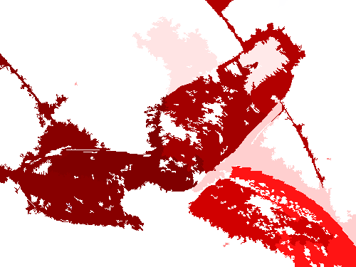

```@meta
CurrentModule = JML_XAI_Project
```

# JML_XAI_Project - LIME and SHAP for Julia
This package implements the explainable AI methods [LIME](https://arxiv.org/abs/1602.04938) and [SHAP](https://arxiv.org/pdf/1705.07874) using [XAIBase.jl](https://julia-xai.github.io/XAIDocs/XAIBase/stable/). LIME and SHAP are **model-agnostic** explainable AI methods, so they can be used to explain any model.
The JMLXAIproject package provides explanations for image inputs and visualizes them as heatmaps.

| **Input**                                  | **Output** |
|:--------------------------------------------- |:------------------------------:|
|                           |                |

To use the package please add the following code to your environment

```julia
using Pkg
Pkg.add(url="https://github.com/e-strauss/JML_XAI_Project.jl")
```

Documentation for [JML_XAI_Project](https://github.com/e-strauss/JML_XAI_Project.jl).


