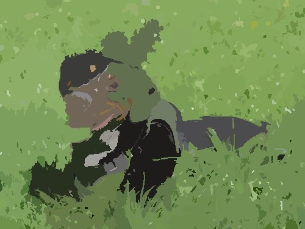
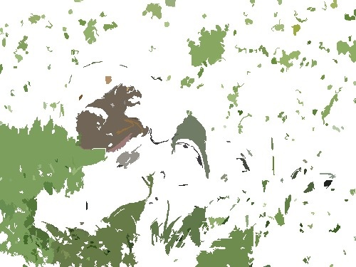
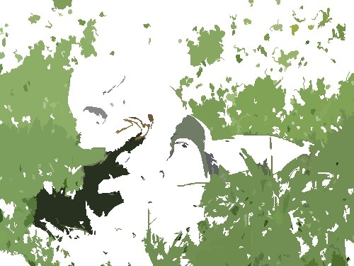

# About LIME
LIME (Local Interpretable Model-agnostic Explanations) approximates a complex model locally by using perturbed inputs (i.e. slightly modified versions of the original data) and training an interpretable model to explain the predictions of the complex model in the neighbourhood of a particular data point.

There are numerous variations in the implementation of LIME. For instance, linear models can be utilized as interpretable models, but decision trees are also a viable option. Additionally, there are various approaches to feature selection, which is an integral part of generating the explanation.

The JML package is based on the [LIME package] (https://github.com/marcotcr/lime/tree/master), which implements different variations of LIME in Python. For the JML_XAI_Project package it was decided to follow the recommendation from this [paper] (https://arxiv.org/abs/1602.04938), i.e. Ridge Regression is used as the interpretable model and Lasso for feature selection.

## How does the code implements LIME for Image Input:
##### 1 Create super pixels for the input image through segmentation
---
The aim of LIME is to generate an interpretable explanation, the first step is to calculate the input image in super pixels. 

| Original input        | Output                     |
|:---------------------------|:------------------------------:|
|   |   |

##### 2 Create different disturbed versions of the super pixels input image
---
Using a mask (a binary vector), the super pixels can then be randomly switched on and off, 1 means super pixel is shown, 0 means no colour value, thus generating an interpretable representation of the image.

|  super pixels input             | disturbed versions 1    | disturbed versions 2 | disturbed versions 3       |
|:-------------------------------|:----------------------------:|:------------------------:|:------------------------------:|
|   | |  |  |

  
##### 3 Predict the class probabilities of disturbed images with classificator
---

##### 4 Calculate distance of features of super pixel image and disturbed images
---

##### 5 Calculate Explanation - calculate weights of each superpixel:
---

- kernel function is applyed on the calculated distances used as weights
- normalize features and labels using weights
- select n features with lasso
- calculate ridge regression model as simplified model with selected features and distance weights
- create a vector with the length corresponding to the number of features, in place of the selected features store their ridge regression coefficients, the other entries are 0

##### 6 Give each segment in the image its calculated weight
---

##### 7 Process the information with XAIBase.jl to display the explanation as a heat map

