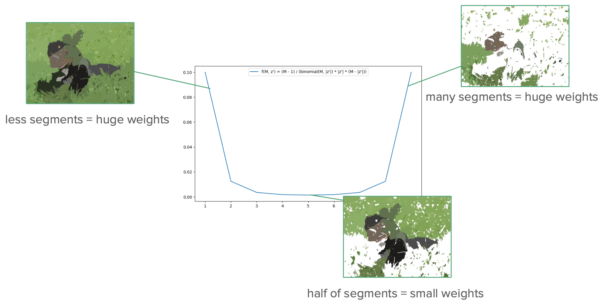

# About SHAP
The implementation of SHAP (**SH**apley **A**dditive Ex**P**lanations) incorporates the idea of Shapley values, which have their origins in game theory. Shapley values indicate how much a player has contributed to the outcome of a group game. This idea has been adapted to explainable AI methods by evaluating how much each feature contributes to the model's prediction, such as in the recognition of an image.

[The paper](https://arxiv.org/pdf/1705.07874), which introduces the idea of SHAP, presents different variations of SHAP. The JML_XAI_Packet implements Kernel SHAP, which is a model-agnostic variant, as it can be easily integrated into the LIME code and is universally applicable in contrast to model-specific variants of SHAP.

## How does the code implement SHAP for image input:
##### 1 Create super pixels for the input image through segmentation
---
The aim of LIME is to generate an interpretable explanation, the first step is to calculate the input image in super pixels. 

| Original input        | Output                     |
|:---------------------------|:------------------------------:|
|   |   |

##### 2 Create different disturbed versions of the super pixels input image
---
Using a mask (a binary vector), the super pixels can then be faded in and out, 1 means super pixel is shown, 0 means no colour value, thus generating an interpretable representation of the image.

|  super pixels input             | disturbed versions 1    | disturbed versions 2 | disturbed versions 3       |
|:-------------------------------|:----------------------------:|:------------------------:|:------------------------------:|
|   | |  |  |

  
##### 3 Predict the class probabilities of disturbed images with classificator
---

##### 4 Calculate shapley weights with weighting kernel:
---
Disturbed images in which very many or very few segments are masked in or out are given high weights, while images in which approximately half of the samples are masked in and out are given a weight close to zero. This way images, in which the influence of a single segment can be preciseley assessed, are higher weighted than those, for which this is not possible.

##### 5 Calculate Explanation 
---
- calculate ridge regression model as simplified model with shapley weights
- create a vector with the length corresponding to the number of features, in place of each feature store their ridge regression coefficients

##### 6 Give each segment in the image its calculated weight
---

##### 7 Process the information with XAIBase.jl to display the explanation as a heat map

